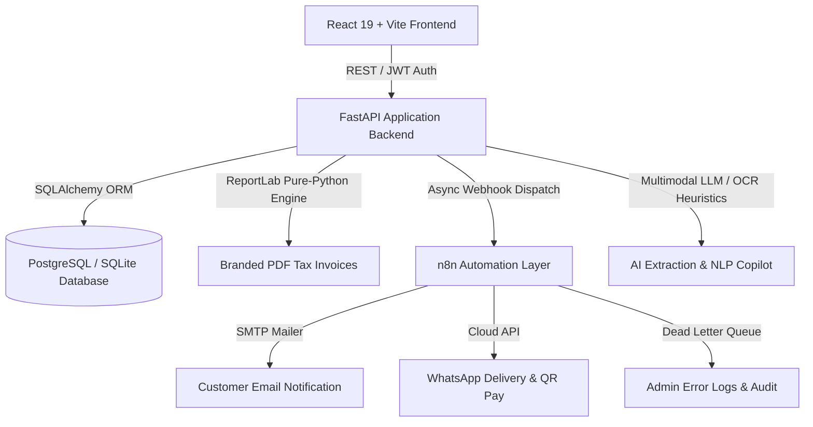

# GreenLife Natural Foods — System Architecture & Design

## 1. System Overview

**GreenLife Natural Foods — AI Automated Invoice System** is a modern enterprise web application designed for agricultural & organic food processing businesses. It streamlines the lifecycle from order placement through pricing arithmetic, ledger balancing, pure-Python PDF tax invoice generation, real-time dispatch via n8n automation, and multimodal AI document extraction.



---

## 2. Directory Structure

The repository is modularly decoupled into three primary execution tiers and documentation:

```
invoice/
├── backend/                        # FastAPI Python 3.12+ Backend
│   ├── app/
│   │   ├── api/                    # REST API Routers
│   │   │   ├── auth.py             # JWT bearer auth & user registration
│   │   │   ├── customers.py        # Customer CRM & credit balance tracking
│   │   │   ├── products.py         # Catalog inventory & unit metrics
│   │   │   ├── orders.py           # Order creation & line item calculations
│   │   │   ├── invoices.py         # Invoices, payments & PDF downloads
│   │   │   ├── payments.py         # Payment collection & ledger adjustments
│   │   │   ├── reports.py          # Daily sales, volume & method aggregates
│   │   │   ├── ai.py               # Multimodal OCR extraction & SQL QA copilot
│   │   │   ├── automation.py       # n8n webhook dispatcher & status telemetry
│   │   │   ├── settings.py         # Merchant settings & profile configuration
│   │   │   └── audit.py            # Immutable system audit trail
│   │   ├── core/                   # Security, database sessions & settings
│   │   ├── models/                 # SQLAlchemy ORM models
│   │   ├── schemas/                # Pydantic validation schemas
│   │   ├── services/               # Core business logic & calculation engine
│   │   │   ├── calculation_service.py # Pure arithmetic calculation engine
│   │   │   ├── pdf_service.py      # Pure-Python ReportLab PDF invoice generator
│   │   │   ├── automation_service.py # n8n webhook dispatch & mock fallback
│   │   │   ├── ai_service.py       # Multimodal OCR & NLP query generator
│   │   │   └── seed_data.py        # Realistic seed database generator
│   │   └── main.py                 # FastAPI application entrypoint & CORS
│   ├── tests/                      # Automated test suites (pytest)
│   │   ├── test_calculations.py    # Unit tests for multi-item calculation math
│   │   └── test_api.py             # Integration tests for FastAPI endpoints
│   ├── Dockerfile
│   ├── pytest.ini
│   └── requirements.txt
│
├── frontend/                       # React 19 + Vite + TypeScript Frontend
│   ├── src/
│   │   ├── components/             # Reusable UI component library
│   │   │   ├── common/             # Badges, Metric Cards, Modal wrappers
│   │   │   ├── layout/             # Top Navbar, Glass Sidebar, PageHeader
│   │   │   └── ai/                 # AI Assistant Modal Dialog
│   │   ├── context/                # React Contexts (AuthContext, ThemeContext)
│   │   ├── pages/                  # Top-level route views
│   │   │   ├── Login.tsx           # Authentication with one-click demo login
│   │   │   ├── Signup.tsx          # Merchant account registration
│   │   │   ├── Dashboard.tsx       # KPI metrics & Recharts sales area chart
│   │   │   ├── NewOrder.tsx        # Dynamic items, balance calculation & instant invoice
│   │   │   ├── Orders.tsx          # Order management & status filtering
│   │   │   ├── Invoices.tsx        # Invoice ledger, payment capture & actions
│   │   │   ├── InvoiceDetail.tsx   # Pixel-accurate printable tax invoice
│   │   │   ├── Customers.tsx       # Customer directory, contact cards & balances
│   │   │   ├── Products.tsx        # Inventory catalog with stock alert thresholds
│   │   │   ├── Reports.tsx         # Financial statements & volume analytics
│   │   │   ├── AiExtraction.tsx    # Drag-and-drop OCR invoice extraction & conversion
│   │   │   ├── Automation.tsx      # n8n pipelines & execution telemetry
│   │   │   ├── Settings.tsx        # Merchant details, GSTIN, and API configurations
│   │   │   └── Profile.tsx         # User identity & security audit trail
│   │   ├── services/               # Axios API client layer with JWT interceptors
│   │   ├── types/                  # Shared TypeScript interfaces & definitions
│   │   ├── App.tsx                 # Protected route hierarchy & layout scaffolding
│   │   ├── index.css               # Tailwind CSS v4 design system tokens
│   │   └── main.tsx                # React DOM root entrypoint
│   ├── package.json
│   ├── tsconfig.json
│   ├── vite.config.ts
│   └── Dockerfile
│
├── n8n/                            # n8n Workflow Automation Layer
│   ├── workflows/                  # Production-ready n8n workflow definitions
│   │   ├── 01_order_processing.json
│   │   ├── 02_email_invoice.json
│   │   ├── 03_whatsapp_notification.json
│   │   ├── 04_ai_invoice_extraction.json
│   │   └── 05_error_handler_dlq.json
│   └── README.md                   # Setup guide and webhook reference
│
├── docs/                           # Comprehensive Engineering Documentation
│   ├── ARCHITECTURE.md             # High-level architecture & data model
│   ├── API_REFERENCE.md            # REST API specifications
│   └── WORKFLOWS.md                # n8n pipeline documentation
│
├── docker-compose.yml              # Complete containerized multi-service compose
├── .env.example                    # Comprehensive environment blueprint
└── README.md                       # Project quickstart & operational manual
```

---

## 3. Financial Calculation Engine

The core arithmetic calculation guarantees consistency across order placement, invoice generation, PDF rendering, and database persistence.

### Mathematical Specification

For an order with items $i = 1, \dots, n$:

1. **Line Item Subtotal**:
   $$\text{Item Total}_i = (\text{Quantity}_i \times \text{Unit Price}_i) \times \left(1 - \frac{\text{Discount \%}_i}{100}\right) \times \left(1 + \frac{\text{Tax \%}_i}{100}\right)$$

2. **Order Subtotal**:
   $$\text{Subtotal} = \sum_{i=1}^{n} (\text{Quantity}_i \times \text{Unit Price}_i)$$

3. **Tax and Courier Adjustments**:
   $$\text{Grand Total} = \text{Subtotal} + \text{Tax Amount} + \text{Courier Charges} + \text{Previous Balance} - \text{Discount Amount}$$

4. **Realized Balance Due**:
   $$\text{Balance Due} = \max(0, \text{Grand Total} - \text{Amount Paid})$$

### Prompt Requirement Test Verification

Given the prompt specification:
* **Product**: 3 kg Marachekku Groundnut Oil @ ₹200/kg = ₹600.00
* **Previous Customer Balance**: ₹400.00
* **Courier Charges**: ₹60.00
* **Tax**: ₹0.00
* **Discount**: ₹0.00
* **Calculation**:
  $$\text{Grand Total} = ₹600.00 + ₹400.00 + ₹60.00 = ₹1,060.00$$

This exact formula is tested and permanently verified in `backend/tests/test_calculations.py`.

---

## 4. Resilience & Fallback Design

* **Database Engine**: Primary support for PostgreSQL via async/sync SQLAlchemy connections; automatic zero-configuration fallback to SQLite (`greenlife.db`) when external database servers are not running.
* **n8n Webhook Fallback**: When an external n8n server is offline or unreachable, the `automation_service.py` logs an informative mock execution and completes the workflow synchronously without disrupting user transactions.
* **Pure Python PDF Rendering**: ReportLab generates PDF invoices directly in memory via byte streams without requiring system-level GTK/Cairo binaries, making it cross-platform across Windows, Linux, and macOS.
