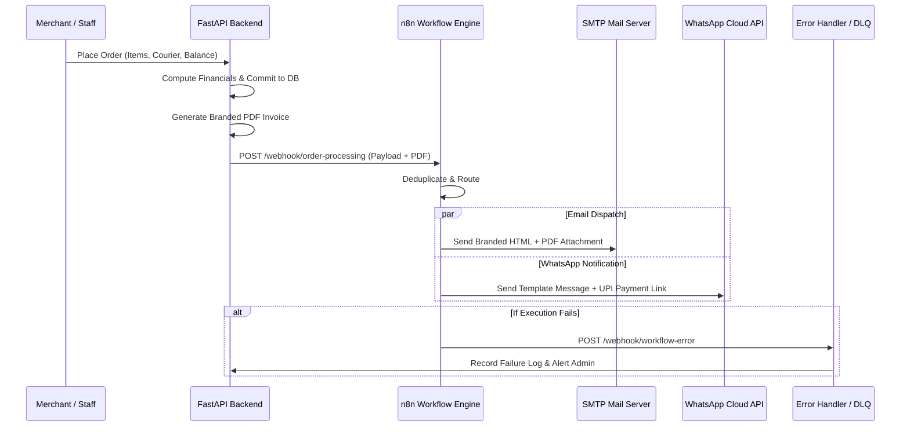

# GreenLife Natural Foods — n8n Automation Workflows

## 1. Overview

The **n8n Automation Layer** orchestrates asynchronous background tasks, decoupled notifications, multimodal document parsing, and exception logging between the FastAPI backend and external third-party communication channels (SMTP Email, WhatsApp Cloud API, Admin Dead-Letter Queues).



---

## 2. Production Workflow Specifications

All workflow definition JSON files are stored in `n8n/workflows/` and can be imported directly into any n8n instance via UI (**Workflows → Import from File**) or via n8n CLI.

### Workflow 01: Order Processing Orchestrator (`01_order_processing.json`)
* **Trigger**: Webhook `POST /webhook/order-processing`
* **Purpose**: Primary orchestrator executed immediately upon order creation.
* **Payload Structure**:
  ```json
  {
    "order_id": 1,
    "order_number": "ORD-2026-0001",
    "invoice_id": 1,
    "invoice_number": "INV-0001",
    "customer": {
      "name": "Ravi Kumar",
      "email": "ravi.kumar@example.com",
      "phone": "+91 98401 23456"
    },
    "totals": {
      "subtotal": 600.0,
      "previous_balance": 400.0,
      "courier_charges": 60.0,
      "tax_amount": 0.0,
      "grand_total": 1060.0,
      "balance_due": 1060.0
    },
    "upi_id": "greenlife@okaxis"
  }
  ```
* **Actions**: Validates payload schema, logs trigger receipt, fans out triggers to Email and WhatsApp pipelines.

---

### Workflow 02: Email Invoice Delivery (`02_email_invoice.json`)
* **Trigger**: Webhook `POST /webhook/email-invoice`
* **Purpose**: Constructs a branded, responsive HTML invoice notification with billing breakdown and dispatches email via SMTP.
* **Nodes**:
  1. **Webhook Ingress**: Receives customer details and invoice parameters.
  2. **HTML Template Generator**: Injects dynamic customer greeting, order line items, UPI payment button, and company footer.
  3. **Send Email (SMTP)**: Sends email with ReportLab PDF invoice attached.

---

### Workflow 03: WhatsApp Customer Notification (`03_whatsapp_notification.json`)
* **Trigger**: Webhook `POST /webhook/whatsapp-notification`
* **Purpose**: Transmits a formatted WhatsApp message with immediate UPI payment intent.
* **Message Template**:
  ```
  🌿 *GreenLife Natural Foods — Order Confirmed!*

  Hello *{{ $json.customer.name }}*, thank you for choosing organic wellness!

  📄 *Invoice Number:* {{ $json.invoice_number }}
  📦 *Order Total:* ₹{{ $json.totals.grand_total }}
  💳 *Balance Due:* ₹{{ $json.totals.balance_due }}

  👉 *Pay via UPI:* {{ $json.upi_id }}
  🔗 Download PDF: {{ $json.invoice_pdf_url }}

  Need assistance? Reply directly to this message.
  ```

---

### Workflow 04: AI Document OCR & Extraction (`04_ai_invoice_extraction.json`)
* **Trigger**: Webhook `POST /webhook/ai-extraction`
* **Purpose**: Ingests uploaded image/PDF attachments, forwards to OCR/multimodal vision LLM, and formats normalized structured JSON.
* **Output Fields**: `customer_name`, `customer_phone`, `line_items` (with unit, qty, price), `courier_charges`, `previous_balance`.

---

### Workflow 05: Error Handler & Dead Letter Queue (`05_error_handler_dlq.json`)
* **Trigger**: Global Error Trigger / Webhook `POST /webhook/workflow-error`
* **Purpose**: Catches uncaught exceptions in any workflow, records error payload in database audit logs, and alerts administrative staff via priority channel.

---

## 3. Resilience & Offline Mock Fallback

The backend application in `backend/app/services/automation_service.py` is equipped with **zero-failure mock fallback**:
* When the n8n webhook responds with `200 OK`, execution telemetry is recorded directly.
* When n8n is offline, unreachable, or in development mode, the request times out safely (2 seconds max) and falls back to a simulated execution record with a full diagnostic log.
* User orders and invoice transactions are **never blocked or rolled back** due to communication network latency.
